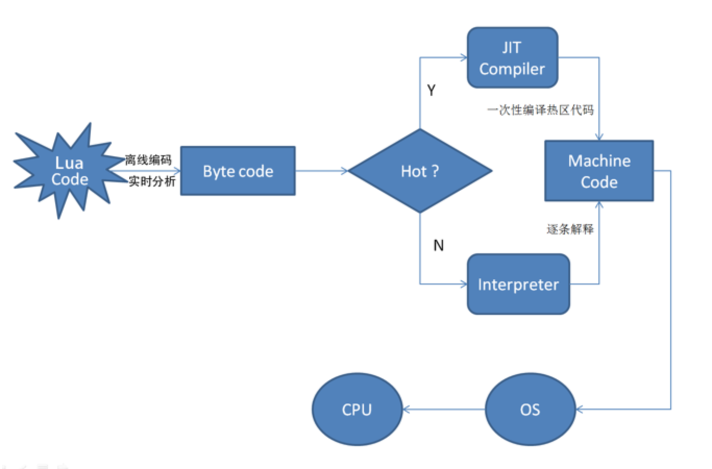
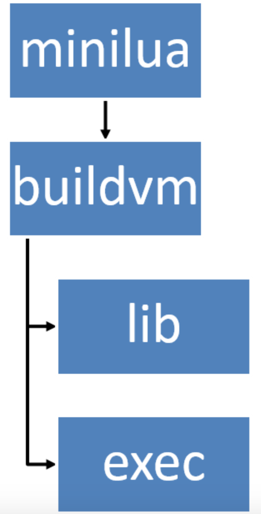

# Lua - LuaJIT 介绍

luajit（www.luajit.org）是 lua 的一个Just-In-Time也就是运行时编译器。

## 什么是 JIT

JIT = Just In Time即时编译，是动态编译的一种形式，是一种优化虚拟机运行的技术。
程序运行通常有两种方式，一种是静态编译，一种是动态解释，即时编译混合了这二者。Java和.Net/mono中都使用了这种技术。
然而IOS中禁止使用（不是针对JIT，而是所有的动态编译都不支持）！

## 为什么要使用JIT

### 解释执行

- 效率低
- 代码暴露

### 静态编译

- 不够灵活，无法热更新
- 平台兼容性差

### JIT

- 效率：高于解释执行，低于静态编译

- 安全性：一般都会先转换成字节码

- 热更新：无论源码还是字节码本质上都是资源文件

- 兼容性：虚拟机会处理平台差异，对用户透明

## LuaJIT

**vs. Lua**
Lua主要由以下三部分组成：

1. 语法实现
2. 库函数
3. 字节码

LuaJIT主要由以下四部分组成：

1. 语法实现
2. Trace JIT编译器
3. 库函数
   1. 原生库++（强化过的原生库）
   2. bit
   3. ffi
   4. jit
4. 字节码

注：最新luajit对应 lua5.1.5.

## trace jit编译器



与jvmjit大致相同。
所谓trace便是一段线性的字节码序列。热点trace被编译成机器码，非热点trace解释执行。
注：并不是所有的代码都能被JIT。

## bytecode

bytecode基本上可以认为是虚拟机的指令码（“基本上”是因为luajit使用了uleb128）。

优点：

1. 减少文件大小。
2. 生成函数原型更快。
3. 增加被破解的难度。
4. 对源代码轻微的优化。
5. 库函数和可执行文件

编译步骤分三步走：



minilua：实际上是lua原生代码的一个子集，用来执行lua脚本并生成平台相关的指令。
buildvm：用来生成操作码/库函数到汇编/C语言的映射，用来jit编译。
lib
exec：可以执行lua代码活转换字节码。

## 编码

命令行执行

```bash
luajit –b <in> <out>
```

虚拟机会判断是否是字节码，所以无需做额外的操作。
另外，可以混用，即：一部分文件编成字节码，另一部分保持源代码。

iSO64位报错问题
Cannot load incompatible bytecode！
这个错是因为在luajit里使用gcr用来比较对象指针，在64位环境下只有47位有效值（默认用户内存不会超过128T）。其余17位中有4位保存对象类型，即一段内存中保存了两条信息。所以在函数栈操作中有些地方需要一个空值占位。因为字节码直接反映了函数栈操作，所以64位和32位字节码不同。


* [目录](00.md)
* 上一章：[编译 Lua 字节码](09.md)
* 下一章：[Lua 5.1 程序接口](11.md)